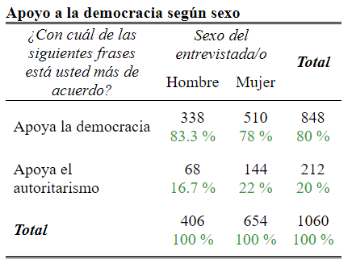
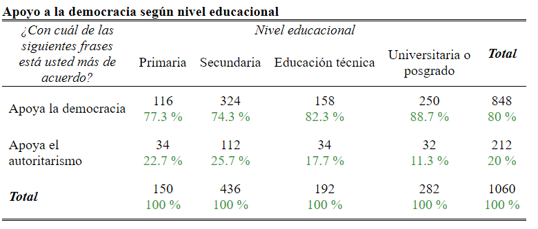
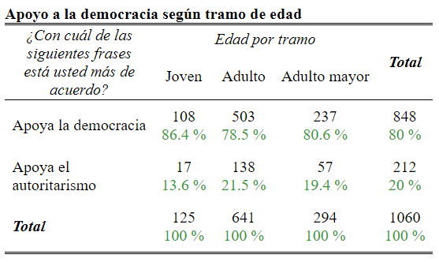

```{r setup, include=FALSE}
knitr::opts_chunk$set(
	message = FALSE,
	warning = FALSE,
	cache = FALSE)
 
Sys.setlocale("LC_ALL","ES_ES.UTF-8")
options(scipen = 999)
getwd()
```

```{=html}
<style type="text/css">

h1.title {
  font-size: 38px;
  color: Black;
  text-align: center;
}
h4.author { /* Header 4 - and the author and data headers use this too  */
    font-size: 18px;
  
  color: Black;
  text-align: center;
}
h4.date { /* Header 4 - and the author and data headers use this too  */
  font-size: 18px;
  
  color: Black;
  text-align: center;
}
</style>
```
\newpage

```{=tex}
\setcounter{tocdepth}{2}
\renewcommand{\contentsname}{Tabla de contenidos}
\tableofcontents
```
\newpage

# 1. Introducción

La presente investigación de tesis tiene como principal objetivo, a través un análisis estadístico multivariado, evaluar la relación entre los conceptos de cultura política y apoyo a la democracia enfocado en analizar el estado de las percepciones de las juventudes chilenas durante el año 2021 y de cómo estas percepciones se proyectan a futuro. 

El estudio de la cultura política y el apoyo a la democracia proviene de antiguas teorías nacidas al alero de estudios conductuales en el área de la psicología. Almond y Verba como propondremos, fueron algunos de los autores pioneros en explicar la naturaleza existente entre cómo los ciudadanos y sus opiniones y percepciones podían influir en la estabilidad democrática. Este trabajo muestra que aunque criticados y ampliamente debatidos, las conceptualizaciones que Almond y Verba propusieron pueden hoy ayudar a explicar no solo el cambio en las formas en que se comparte la política, sino también en cómo esta se ve sumergida en una red cultural mucho más amplia que moldea la vida social y otorga elementos y definiciones comunes entre la ciudadanía.

De esta forma, a la luz de las propuestas teóricas clásicas también se examinará en aquellas teorías contemporáneas que han redefinido el estudio de la cultura política, expandiendo sus alcances a través de los cambios que generaron las problemáticas asociadas a la calidad de las democracias que transitaron desde regímenes autoritarios en América Latina. (Morlino, 2007) Estas problemáticas han sido identificadas como parte de las causas que distintos autores han teorizado como el surgimiento de 'ciudadanías críticas' (Norris, 1999) así como también 'demócratas insatisfechos' (Klingeman, 2014; Navia et. al 2021), tipos de ciudadanos que, "si bien consideran que la democracia es la mejor forma de gobierno y rechazan los regímenes autoritarios, identifican varios aspectos negativos en la forma como la democracia funciona en sus países". (Bargsted & Somma, 2018)

Esto ha convergido en lo que algunos autores han denominado el cambio desde una cultura política de 'lealtad' a una de 'asertividad' hacia el régimen democrático, (Dalton y Welzel, 2014) oponiéndose en su lógica de entender la necesidad de un alto apego hacia el régimen democrático como forma de mantener la estabilidad democrática, sino explicando que un bajo apego hacia el régimen puede ser en realidad síntoma de una democracia activa. En palabras de Pippa Norris "una larga tradición jeffersoniana dice que no debemos preocuparnos demasiado por el declive en la confianza en el gobierno. Si las encuestas reflejan cautela en vez de cinismo, los resultados podrían ser saludables: ciudadanos críticos son buenos para la democracia". (Norris, 1999)

En este sentido, la importancia de estudiar la relación entre la cultura política y el apoyo a la democracia surge debido a que los procesos políticos de aculturación son más entendibles si los vemos bajo la luz de las resistencias y las tendencias transformadoras e incorporativas del cambio cultural en general. (Almond y Verba, 1963) De esta forma, creemos que las modernizaciones y transformaciones que se gestan en las sociedades del mundo implican cambios culturales que logran ser absorbidos por las personas a través de lo que ha sido descrito como la "modernización social". (Norris, 2004)

Teniendo en cuenta las sugerencias de Almond y Verba sobre la importancia del cambio cultural general, para llevar a cabo nuestra investigación nos parece pertinente primero realizar una contextualización que explique el devenir del sistema político en Chile, explicando brevemente las causas de sus problemas en torno a la representatividad política en base a lo que la evidencia científica ha aportado para de esta forma entender bajo qué escenario se desenvuelve hoy en día la incidencia en la participación política de la juventud chilena. En seguida, brevemente, otorgamos la justificación de nuestra investigación.

Posteriormente, en el apartado de marco teórico agrupamos lo que, a nuestro parecer, es identificado como la literatura más relevante pero no exclusiva en torno al estudio de la cultura política y el apoyo a la democracia, ambos como conceptos diferenciados. Por esta razón, proponemos primero explicar la dimensión de cultura política, su discusión teórica entre distintos autores y sus propuestas para medir aquellos componentes actitudinales frente a la estructura política para de esta forma lograr definir con claridad conceptual qué entenderemos por cultura política.

En seguida, propondremos el debate en torno al concepto de apoyo a la democracia, haciendo un repaso por las teorías que explicarían el nacimiento de este así como su uso en distintas encuestas de opinión pública, o también como un medidor asociado a causas históricas como la famosa democracia churchilliana, terminando por último proponiendo cómo será entendido el concepto de apoyo a la democracia para los fines de nuestra investigación.

Avanzado el marco teórico, expondremos la metodología que hemos diseñado para nuestra investigación. Dentro de las limitaciones de nuestro artículo, proponemos realizar un análisis cuantitativo multivariado a través de modelos de regresiones logísticas binarias, que otorguen noción sobre qué tan probable es que se apoye la democracia con relación a orientaciones que tiene la ciudadanía chilena sobre ciertos componentes de cultura política. Además de esto, verificamos el estado actual de estos indicadores, ofreciendo una contextualización más robusta en torno a los datos entregados.

Entonces, a la luz de nuestros resultados proponemos realizar un análisis e interpretación de estos datos bajo el prisma de lo que la teoría y nuestra propia experiencia nos puede otorgar. De esta forma buscamos lograr entregarle sentido a aquello que proponemos, incluso cuando nuestras hipótesis puedan ser rechazadas y nuestros análisis inertes.

Por último, en las conclusiones debatiremos en torno a los hallazgos encontrados y propondremos nuevas líneas de investigación en torno a aquellos componentes que puedan ser interesantes. Esperamos de esta forma poder entregar un relato coherente desde principio a fin, que a pesar de sus debilidades, pueda exponer aquello que no resulta tan evidente de ver, o más difícil aún, de demostrar.

# 2. Justificación

En el caso chileno, consideramos que estudiar la cultura política de las juventudes es un aporte que va en la dirección correcta. Esto pues los 
jóvenes no han sido objeto predilecto del estudio de las ciencias sociales y tampoco en la historia (...) no han sido considerados como actores o sujetos sociales, minimizándolos en otras categorías. (Zarzuri, 2016) Esta situación nos invita a reflexionar desde la ciencia política en torno al estudio de las juventudes ciudadanas y sus percepciones hacia la democracia y sus valores de cultura política.

Además de esto, estudiar la relación entre política y juventud puede estar alertando al mundo social sobre nuevas formas de entendimiento público, liderados por jóvenes que hoy se identifican como parte de una multitud que ha experimentado un despertar ciudadano, exigiendo mayor participación social. (Rivera et. al, 2020) Ante esto, esperamos nuestra investigación pueda otorgar pequeños aportes en torno a estas investigaciones surgidas previamente y posterior al Estallido Social de 2019 en donde por una parte vemos cómo ya las ciencias sociales advertían hace años problemáticas que necesitaban ser resueltas en pos de una mejor convivencia social, por ejemplo, respecto a la herencia de enclaves autoritarios en Chile que, algunos, han logrado persistir hasta hoy. (Garretón, 2010; Siavelis, 2009)

Tenemos en cuenta también que la desafección política y la baja abstención electoral es uno de los grandes desafíos que enfrentan las juventudes en términos de participación política. Autores como Parker definen la abstención electoral como el “desinterés creciente por la política, utilizando como indicador la escasa inscripción de los jóvenes en los registros electorales y en la escasa voluntad de participación activa en política”. (Parker, 2003) Sin embargo, hay quienes contrargumentan esta situación explicando que la actitud desafecta sería coherente con un escenario político en el cual estén vigentes los denominados poderes fácticos, los cuales distorsionan el sistema político, es decir, el fenómeno de la desafección se correlacionaría positivamente con la existencia de un sistema político alterado. (Mardones, 2014) Esta desafección, sin embargo, según la evidencia científica sitúa sus causas en el rechazo hacia el sistema electoral y los políticos, y no por ‘apatía’ o ’desinterés’ hacia la política. (Sola Morales, 2015)

Con mayor importancia aún, es preciso cuestionar y hallar las motivaciones sociopolíticas y culturales de este supuesto desinterés generalizado. La cada vez más elevada indiferencia o rechazo de los  jóvenes  hacia  el  sistema  político  pone  de  manifiesto  la necesidad de reflexionar y profundizar en las posibles causas de este fenómeno. (Sola-Morales y Hernández-Santaolalla, 2017)

Ante esto, consideramos que aunque los jóvenes no hayan sido un importante objeto de estudio por parte de las ciencias sociales, sumado a que parte de la evidencia sobre desafección política explica que la escasa participación de los jóvenes ha llegado a reducir su capacidad para influir en la priorización de sus políticas públicas, (Toro, 2007) proponemos que estas situaciones no solo han ido cambiando con el paso de los años a raíz de las transformaciones y desafíos que el mismo sistema político chileno ha enfrentado, justamente, desde las juventudes, sino que también a su vez proponen formas distintas de resignificar el concepto de la política, en oposición a lo que los jóvenes identifican con la 'vieja política'. (Zarzuri, 2020)

En este sentido, estudiar qué piensa la juventud puede ser clave pues los jóvenes de este nuevo siglo no solo tienen que enfrentar a las crisis de instituciones clásicas como la educación o la familia, sino también a las transformaciones de las formas de participación clásica en la esfera de lo público, abandonando de cierto modo esos lugares tradicionales para transitar hacia otros ámbitos. (Zarzuri, 2016)

# 3. Contextualización

Si bien el contexto en el que ubicamos nuestra investigación corresponde al año 2021, el telón de fondo a través del cual se han desarrollado aquellas problemáticas asociadas al funcionamiento del sistema político chileno en términos de representatividad política están arraigados en lo que la literatura académica ha identificado desde los primeros estudios relacionados a la cultura política de la época de la transición, la cual en el caso chileno se caracterizó según Huneeus por la división originada por el régimen militar que creó una democracia semisoberana, caracterizada por la distinta evaluación que hacen de su desempeño los partidarios y detractores de la dictadura, por la baja confianza interpersonal en las instituciones y en las elites políticas, junto a una evaluación crítica del desempeño de los políticos, además de un bajo apoyo a la democracia. (Huneeus,2018)

A nuestro parecer, este contexto está marcado por lo que es identificado como el ‘debilitamiento del desarrollo político’ comenzado desde 1990 atribuible a que los nuevos gobiernos optaron por una forma de representación tecnocrática, en la lógica de los expertos, y no por otra que girara en torno a los partidos, lo que les ha debilitado ante el electorado como organización y en sus capacidades de participar en el gobierno (Huneeus, 2018) De esta forma, identificamos que nuestro problema de investigación está cruzado por estas dos dimensiones del debilitamiento del desarrollo político en Chile: por un lado, los efectos de la política tecnocrática en la representatividad política y por otro, los efectos de la desconexión entre movimientos sociales y partidos políticos. 

Bajo este contexto, primó la llamada ‘política de los consensos’, por medio de la cual las decisiones políticas de envergadura eran adoptadas por las elites políticas sin mayor influjo de la ciudadanía organizada. (Somma y Bargsted, 2015; citado en Huneeus, 1996) En este sentido, distintos autores explican que la lógica que operó en la política de los 90’ estuvo caracterizada por una ‘desmovilización desde arriba’ por parte de los partidos de la transición la cual apostó por una transición contenida, motivada por el miedo a que las movilizaciones sociales superen el marco de la negociación y que los militares vuelvan a imponerse, como eco de los años 1970. (Barozet, 2016)

Esta situación creó a lo largo de los 90’ el desacople entre los partidos políticos y la opinión pública, particularmente sus sectores activos representados por movimientos sociales, con un receso de la conflictividad social, en un marco de des-ideologización. (Barozet, 2016) Todo esto supuso la desmovilización de los movimientos sociales, los cuales, en aras de la construcción de una democracia que fue concebida como frágil en sus inicios, tenían que desaparecer o invisibilizarse en la llamada transición. (...) Entonces, no hubo más movilizaciones ni movimientos, porque no calzaban con el nuevo orden democrático o, mejor dicho, ponían en riesgo la frágil democracia y su estabilidad. (Zarzuri, 2016)

Este escenario con el paso del tiempo fue advertido tempranamente por parte de las ciencias sociales, quienes focalizaron su estudio en el distanciamiento y elitización cada vez más evidente entre partidos políticos y movimientos sociales ciudadanos. Este periodo del término de la década de 1990 es identificado con como el comienzo del proceso de autonomización de la protesta contextualizado por una situación que combinaba la ausencia de grandes movilizaciones colectivas contra el gobierno con altos niveles de afección política, que ya para el fin del 90 empieza a mostrar signos de agotamiento de la desmovilización que la sociedad chilena venía experimentando desde 1980. (Somma y Bargsted, 2015) 

Posteriormente, Medel y Somma argumentan en favor de la tesis del desapego entre movimientos sociales y partidos políticos, donde con el paso del tiempo se volvió evidente que los gobiernos concertacionistas no querían envolverse en reformas estructurales en torno a demandas del mercado laboral, la educación, derechos indígenas, el sistema electoral, entre otros. (Somma y Medel, 2017) Los autores también aportan evidencia sobre que, desde comienzos del nuevo milenio las protestas colectivas han crecido en Chile en el periodo entre 2000 – 2012 y que esto es exacerbado porque como la política institucional no produce los cambios que exigen los movimientos sociales, la protesta colectiva se convierte en una estrategia política más atractiva y plausible. (Somma y Medel, 2017) 

Sumado a esto, distintos autores explican que varios fenómenos que ocupan a los académicos en Chile desde la segunda mitad de los años noventa pueden leerse en clave de cultura política: la dramática caída de la participación electoral y en la confianza en las instituciones políticas (citado en Navia et al. 2004) el declive de la identificación partidaria y la identificación con ideologías políticas (citado en Navia y Osorio, 2015), el desarraigo del sistema de partidos (citado en Luna y Almant, 2011) y la emergencia de movimientos sociales y olas de protestas de gran magnitud (citado en Somma y Medel, 2017). Esto pues la ventaja del enfoque de la cultura cívica es que ofrece un marco unificado para entender todos estos procesos que, si bien relacionados, por lo general se estudian de modo independiente. (Bargsted y Somma, 2018)

Teniendo estos antecedentes en cuenta, el periodo en el que se enmarca esta investigación es durante el año 2021 y se ha escogido en consideración de lo que la evidencia académica ha identificado desde 2006 como el inicio de un nuevo ciclo de protesta que es intensificado desde 2011 “cuyas principales expresiones son el movimiento de los ‘pingüinos’ y luego el estudiantil. (...) Este ciclo se abrió en 2006 pero sigue generando a la fecha expresiones y demandas variadas, que se mantienen o reactivan cada cierto tiempo, con fórmulas diversas y cambiantes de relaciones con los partidos políticos”. (Barozet, 2021; Somma y Bargsted, 2015) Se propone que este nuevo ciclo de protestas puede ser interpretado como un cambio en la cultura política de las juventudes ciudadanas chilenas apoyado desde las nuevas teorías que explican la variación en el concepto desde sus orígenes propuestos por autores como Almond y Verba. 

# 4. Problematización (agregar objetivos)

En términos de representatividad política, el estilo tecnocrático de la política chilena llevada adelante desde la transición a la democracia ha tenido importantes efectos en la relación tanto entre partidos políticos y gobierno, y partidos políticos y movimientos sociales, lo que pone al centro del análisis la capacidad de la estructura intermedia del sistema para absorber y procesar las demandas ciudadanas. 

Por una parte, privilegiar la política tecnocrática a través de expertos sin incluir a los partidos políticos en la definición de la política programática ha disminuido la capacidad de agencia por parte de estos para promover la instalación de los intereses de sus representados, generando una lejanía entre los intereses ciudadanos y los resultados ofrecidos por sus representantes.

Sumado a esto, autores como Garretón exponen que en Chile vivimos en una ‘democracia incompleta’ debido a la persistencia institucional de enclaves autoritarios (Garretón, 2010) que constituirían parte importante de los factores que estrecharían aquellos márgenes de acción y de cambio dentro del sistema político chileno hacia una mayor profundización de la democracia. Específicamente, cuando hablamos de representatividad política estos enclaves heredados de la dictadura han constreñido importantemente la participación política de la ciudadanía, acotando su margen de acción a los actores directamente vinculados a su ejecución, a saber, la clase política representada por los partidos políticos y el gobierno, representados por los actores políticos en posiciones de poder. (Siavelis, 2009)

No obstante, otros autores advierten que pareciera ser que Chile ha resuelto la tensión entre estabilidad política democrática e incorporación social, pero los análisis ahora apuntan a los riesgos de una desmovilización política diseñada por élites desconectadas. (Luna. 2016) En este sentido, el escenario político que enfrenta la contingencia del sistema chileno está atravesado fuertemente por una crisis de representatividad caracterizada por tener un sistema de partidos altamente estable y comparativamente bajos niveles de identificación ciudadana con los partidos políticos, (Luna, 2016)

Sin embargo, creemos que ante esta situación las juventudes ciudadanas en Chile ofrecen nuevas posibilidades de cambio en vista a los próximos años pues según la evidencia científica existe un gran apoyo por parte de las juventudes hacia la democracia como mejor forma de gobierno, una alta tasa de participación electoral así como los mayores porcentajes de interés en la política desde 2012. (Instituto Nacional de la Juventud, 2022) 

Por esta razón, este estudio buscará analizar e interpretar los cambios en las percepciones y opiniones ciudadanas en las juventudes chilenas entre 18 y 40 años residentes Chile utilizando los datos disponibles del Estudio Longitudinal Social en su ola número 5 2021. De esta forma se busca indagar sobre cómo las distintas percepciones y opiniones hacia los componentes, actores e instituciones del régimen democrático en Chile vinculan su relación con el apoyo a la democracia. Esta relación entre el sistema político, la ciudadanía y la democracia es lo que distintos autores han definido como Cultura Política poniendo énfasis en que su estudio es relevante ya que la cultura política de una sociedad puede convertirse en un factor explicativo potente de la estabilidad y modernización democrática. (Schneider & Avenburg, 2015) 

Bajo este contexto y diagnóstico que identificamos en el sistema político chileno es donde situamos el problema central de nuestra investigación, a saber, el desencuentro entre la política institucional y la ciudadanía en su conjunto y los efectos de esta situación en el apoyo a la democracia por parte de los jóvenes. Esta desconexión, evidenciada de manera importante por múltiples autores es reflejada a través de una estructura política no solo desconectada, sino también exclusiva en términos de participación política en la toma de decisiones que ha provocado reacciones inesperadas por parte de los actores políticos ciudadanos.

En este contexto nos parece relevante entonces preguntarnos ¿De qué forma los indicadores de cultura política impactan en el apoyo a la democracia en las juventudes chilenas durante el año 2021?; ¿Pueden las preferencias de la cultura política aumentar las chances de apoyar la democracia?

Si bien es esta la pregunta que guía nuestra investigación, también invitamos a cuestionarnos sobre el estado de las culturas políticas de las juventudes chilenas y hacia dónde se dirigen, dentro de un contexto político donde problemas como la persistente crisis en la representatividad política invitan a los jóvenes a tomar otras iniciativas de acción, involucramiento y participación política ajenos a espacios institucionalizados que otorgan nuevos significados a sus acciones colectivas. (Sola – Morales y Hernández-Santaolalla, 2017) 

Por esta razón, justificamos nuestra propuesta de investigación en torno a la problemática que surge ante una juventud ciudadana que está entre la desafección política y su repolitización ante un contexto socialmente tecnologizado, influido fuertemente por las Tecnologías de la Información y el Conocimiento. En este sentido, querer conocer más sobre cómo es percibida la relación que existe entre las juventudes ciudadanas es una invitación a reflexionar si es que, efectivamente, a la luz de nuestras experiencias de socialización política las juventudes han internalizado más fuertemente aquellos valores democráticos. (Sanhueza et al., 2015)

# 5. Marco teórico

## 5.1 Cultura política

En términos generales, el estudio y constante debate en torno al concepto de cultura política es amplio y diverso entre las disciplinas de la sociología y ciencia política, existiendo vasta literatura académica respecto a sus constantes diagnósticos e interpretaciones. Es necesario, entonces, para los fines de esta investigación hacer una breve revisión sobre la variación que el concepto ha tenido en las últimas décadas en torno a la luz de nuevas propuestas teóricas relacionadas a las nuevas conceptualizaciones de cultura política. Para hacerlo, proponemos tomar como referencia el modelo de Almond y Verba propuesto en Civic Culture para de esta forma poder contrastar los cambios que ha enfrentado la teoría desde sus cimientes iniciales.

### El modelo de Almond y Verba 

Desde los primeros estudios empíricos como _Civic Culture_ (1963) Almond y Verba explican que el estudio de la cultura política debe su origen a las investigaciones que surgieron desde el enfoque conductual sobre las políticas originadas del periodo de entreguerras. Desde ese momento, la investigación desde la ciencia política se volcó a estudiar los _nuevos aspectos de la política_ relacionados al escenario internacional de posguerra y de las transformaciones sociales que experimentaron las naciones industrializadas que serían parte temática de su libro. En él, los autores buscaron analizar lo que los griegos llamaron _virtud cívica_ y sus consecuencias en la efectividad y estabilidad de la política democrática. (Almond y Verba, 1963)

Aunque criticado y cuestionado, creemos que el modelo para estudiar la cultura política propuesto por Almond y Verba en _‘Civic Culture’_ es un marco analítico sólido pero no exclusivo para aproximarnos al estudio de este concepto en el caso chileno. En términos generales, los autores explican que la cultura política de una sociedad es referida a la “internalización del sistema político en las cogniciones, sentimientos y evaluaciones de su población” refiriéndose a que es condición necesaria para la formación de una cultura política el haber tenido “acercamientos individuales sistemáticos hacia los objetos políticos”. (Ídem, 1963) 

Más precisamente, los autores se refieren a la cultura política como el resultado de “la particular distribución de las pautas de orientación hacia los objetos políticos entre los miembros de una nación”. (Almond y Verba, 1963) Estas orientaciones son definidas como “cognitivas, de afecto y de evaluación” y son estas las que pueden ser dirigidas hacia distintos componentes de un sistema político, entre ellos, “el sistema como objeto general, objetos políticos (inputs), objetos administrativos (outputs) y uno mismo como objeto”. (Ídem, 1963)

Las orientaciones cognitivas son referidas al interés y conocimiento político, que procura medir el grado de interés y conocimiento de los asuntos políticos y públicos. La dimensión afectiva está relacionada con los sentimientos y actitudes generadas hacia el sistema en su conjunto: hacia la nación, sus virtudes y del afecto al sistema, así como también el afecto hacia los outputs, es decir, de las clases de expectativas que tiene la gente sobre el trato a recibir de manos de las autoridades gubernativas. (Almond y Verba, 1963) Por último, las orientaciones evaluativas están asociadas a las percepciones sobre la democracia y la satisfacción que pretenden medir el nivel de eficacia del sistema. (Martínez, 2012) 

Sin entrar en mayor detalle, estas orientaciones dirigidas hacia distintos componentes del sistema político son clasificadas entre tres tipos de cultura política: parroquial, de súbdito y de participante. En términos generales, la cultura política parroquial se refiere a aquellos ciudadanos que tienen una nula o escasa vinculación con el sistema, generalmente ubicados en zonas rurales e identificados en países en desarrollo con una baja institucionalidad política; la cultura de súbdito es referida a tipos de ciudadanos que se relacionan en mayor medida con el sistema político, conocen acerca de sus representantes, interactúan con sus instituciones pero limitan su vinculación solo a un nivel administrativo sin tener orientaciones definidas en torno a objetos políticos; por último, la cultura política de participante se caracteriza por ser la de un tipo de ciudadano que tiende a tener una vinculación sistémica hacia el régimen democrático, sostienen opiniones hacia los objetos políticos tanto como a los inputs y outputs del sistema y se identifican así mismos como personas con un rol activo. 

Vale mencionar que además de estas tres tipologías, los autores advierten que este “solo es el comienzo” para evaluar la cultura política de una nación, pues estas pueden matizarse entre sí dando espacio a culturas políticas que combinen distintos componentes de otra. En este sentido, se hace hincapié en que la cultura cívica es una mezcla entre estos distintos tipos de culturas entre los ciudadanos, por lo que no pretenden ser categorías exclusivas.

Dentro de las conclusiones de su trabajo, los autores buscan desarrollar la respuesta a la pregunta de si ¿existe una cultura democrática -una pauta de actitudes políticas que fomente la estabilidad democrática, que en algún sentido “resulta apropiada” al sistema político democrático? Para responder a esta pregunta, los autores argumentan sobre un “tipo de ciudadano” que sería necesario para la estabilidad democrática, referente a “un ciudadano informado, comprometido, racional y activo”. Nos referimos con esto a que el modelo propuesto en Civic Culture era uno según el cual la prosperidad democrática provenía también de un alto apego afectivo desde el ciudadano hacia el régimen democrático, que entendía su participación dentro del sistema político como un individuo que incluso con un perfil de participante entendía que habían ciertos escenarios o acciones que no estaban dentro de sus capacidades, como fiscalizar a las autoridades o en general, desconfiar del sistema político. En otras palabras, este modelo es el que autores como Dalton identifican como un modelo basado en la lealtad o allegiance hacia el régimen político. (Dalton y Welzel, 2014)

### Un debate abierto 

Es por estas y otras razones que el mundo académico ha reconocido la obra de Almond y Verba como pionera en lo que respecta al análisis de la política comparada en términos de los valores culturales y políticos que comparten las ciudadanías dentro de las sociedades. Sus hallazgos sobre cómo se vinculan las personas con el sistema bajo el cual viven, aunque cuestionados, invitaron a la investigación científica a ampliar el campo de estudio, profundizando aquellas vetas que no habían sido hasta ese entonces exploradas. Sin embargo, a pesar del mérito académico que despierta hasta hoy, como cualquier otro objeto de estudio, la cultura política ha sido reinterpretada a la luz de las transformaciones sociopolíticas que han sido evidenciados tanto por la sociología y la ciencia política en torno a los procesos de modernización, transición y democratización en distintos regímenes políticos alrededor del mundo así como también en América Latina. (Huntingron, 1994; Garretón, 2003) 

Entrando más a fondo en la discusión, desde el mundo europeo y estadounidense a nuestro parecer es donde hemos identificado grandes debates en torno a la cultura política, sus variaciones tanto conceptuales como metodológicas respecto a sus formas de entenderlas e intentar medirlas, así como también sobre la reflexión en torno al diagnóstico propuesto por distintos autores acerca de las teorías de la modernización y posmodernización que se posiciona como un paradigma en la teoría. 

Robert Inglehart es de aquellos autores que han aportado largamente al estudio de la cultura política, bajo marcos analíticos que consideran primero los cambios culturales respecto a los valores sociales compartidos, especialmente, por las sociedades industriales. Es así que en distintas publicaciones y libros desarrolla lo que él denominó en un primer acercamiento “the silent revolution” donde alertaba sobre dos aspectos claves: un cambio en el énfasis abrumador de los valores materiales y la seguridad física hacia una mayor preocupación por la calidad de vida, y; un aumento en las habilidades políticas de los públicos occidentales que les permite desempeñar un papel más importante en la toma de decisiones políticas importantes. (Inglehart, 1977)

Respecto a esto último, ya durante esos años, Inglehart advertía que un cambio significativo estaba tomando lugar respecto a la distribución de habilidades políticas debido a que una importante proporción del público comienza a tener suficiente interés y entendimiento sobre política nacional e internacional para participar a este nivel en la toma de decisiones. Argumentaba, Inglehart, que los cambios actuales han permitido (al público) desempeñar un creciente rol activo en la formulación de la política y cada vez más envuelta en lo que ha sido llamado “elite-challenging”, entendido como el hecho de que el potencial de las “contra-elites” estaba abiertamente distribuido entre el público como nunca antes. (Inglehart, 1977) Esto es lo que sería entendido posteriormente como el comienzo de la erosión del modelo de lealtad de ciudadanías democráticas. (Dalton y Welzel, 2014)

Entre sus hallazgos, Inglehart identificó un aumento generacional de la seguridad existencial (respecto a la seguridad e integridad física) y la movilización cognitiva como las fuerzas sociales que impulsan el surgimiento de estos nuevos valores; de esta forma, el autor extendió los conceptos de valores postmaterialistas, desarrollado en Modernization and Postmodernization, hacia un concepto más amplio de valores de auto-expresión. De esta forma, se reconoce que estas teorías enriquecieron el campo de estudio de la cultura política con un set de ideas y conceptos que incrementaron de forma importante el entendimiento del cambio cultural. (Dalton y Welzel, 2014)

De hecho, sería Inglehart quien ayudó a desarrollar las encuestas del Eurobarómetro, contribuyó al Estudio de Valores Europeos y fundó la Encuesta Mundial de Valores, que es considerada la base de datos más completa, citada y utilizada, y más reconocida para estudiar la cultura política y el cambio cultural de las sociedades alrededor del mundo. (Dalton y Welzel, 2014) De esta forma, a modo de síntesis, podríamos decir que la variedad de estos estudios han creado una infraestructura teórica y metodológica robusta en torno a la investigación de la cultura política. Se advierte, por la misma razón, que si bien esta es una parte importante de su desarrollo conceptual, el estudio de la cultura política trasciende en muchas más direcciones y elaboraciones académicas.

Por otra parte, Robert Dalton en su libro Democratic challenges – democratic choicees aborda los desafíos que enfrentan las democracias contemporáneas que, en su perspectiva, tiene sus orígenes en la erosión de la confianza y el apoyo ciudadano. De esta forma, buscar analizar los cambios y problemáticas que, según el autor, no provienen de enemigos dentro o fuera de la nación. En cambio, estos desafíos derivan de los propios ciudadanos de la democracia, quienes se han vuelto desconfiados de los políticos, escépticos de las instituciones la democracia y desilusionados acerca de cómo funciona el proceso democrático. (Dalton, 2004) Esta situación es la que Dalton identifica como el surgimiento de un nuevo tipo de ciudadano: el crítico o el demócrata insatisfechos, ambos productos de los argumentos planteados anteriormente. Por último, incluyendo tres de las dimensiones propuestas por Almond y Verba, y lo complementa añadiendo dos dimensiones: la participativa y la dimensión institucional. Entre otros, evalúa indicadores de apoyo político, como la confianza hacia las instituciones democráticas, la satisfacción con la democracia, la identificación política, el efecto de los medios de comunicación, entre otros. (Dalton, 2004)

Por otra parte, es largamente identificado dentro de la literatura sobre cultura política la conceptualización propuesta por David Easton respecto al análisis de lo que el denomina ‘apoyo político’. Para esto, distingue categorías de apoyo hacia los objetos políticos en tres dimensiones: la comunidad política, el régimen y las autoridades políticas. En los términos de nuestra investigación, solo nos enfocaremos en explicar la dimensión de ‘apoyo al régimen’. Fundamentalmente, este concepto es referido como las actitudes públicas hacia el orden constitucional. Estas actitudes pueden ser de distintos tipos que escapan a nuestro análisis, siendo el más importante las orientaciones hacia las instituciones políticas, tales como la evaluación del Congreso, los partidos políticos, las instituciones de justicia, así como cualquier otro actor institucional, entre los que pueden identificarse aquellas autoridades que detenten cargos de autoridad política tales como presidentes, ministros, legisladores o en un amplio espectro entre las elites políticas. (Easton, 1965; citado en Dalton, 2004)

Por último, en vista de los cambios producidos en las ciudadanías del mundo occidental, Pippa Norris extiende la investigación sobre las dimensiones del apoyo político por parte de la ciudadanía. Explica que para realizar una correcta evaluación en términos de asociatividad con el sistema político, los ciudadanos deben poder comparar y evaluar tipos de regímenes alternativos, más allá del régimen particular bajo el cual estén viviendo. (Norris, 1999) Por esta razón, fija su análisis en tres dimensiones: el apoyo de la comunidad política, la democracia como forma ideal de gobierno y la actuación del régimen a través de preguntas concernientes al tipo de régimen político preferido, hacia la evaluación de la democracia, hacia la satisfacción con la misma, así como la evaluación que los ciudadanos puedan hacer sobre los distintos actores políticos como el congreso o el gobierno. (Norris, 1999) Para el caso chileno, Norris identifica un alto apoyo a la democracia como forma ideal de gobierno con un 79% siendo esta una de las pocas mediciones realizadas en este estudio en la región latinoamericana. 

Ahora, hasta aquí hemos hablado sobre el concepto de cultura política así como distintas interpretaciones que fueron dándose con el paso del tiempo, tomando en consideración nuevos ‘indicadores’ de los cambios en las sociedades del mundo. No obstante, estas apreciaciones provienen en su gran mayoría desde corrientes europeas y estadounidenses que, si bien explican las formas mediante las que se da el cambio social, lo hacen desde contextos sociales, inevitablemente, muy distanciados de las sociedades y realidades latinoamericanas. 

Ante esto, nos parece importante entonces preguntarnos ¿qué ha pasado entonces con la cultura política en Chile? ¿Qué nos pueden aportar a nuestra discusión distintos autores nacionales y latinoamericanos sobre el devenir en las formas en que la ciudadanía chilena ha visto imbuida su relación con el Estado y la política? Ante esto, creemos que ciertos autores claves pueden darnos ideas interesantes sobre esta búsqueda,  

En este sentido, autores como Jorge Larraín nos aportan valiosísimos alcances y explicaciones que nos permitirán entender de mejor forma cómo es entendido el cambio social en contraposición de lo que han sido las teorías de la modernización y postmodernización propuestas y descritas anteriormente. 

Larraín explica que es necesario advertir contra dos formas equivocadas y parciales de entenderlo. Una fue utilizada por las teorías de la modernización de la sociología norteamericana, que lo describen como un proceso evolucionario continuo desde la sociedad tradicional hacia la sociedad moderna, que sigue un curso histórico similar, aunque desfasado, en todos los países, de acuerdo a ciertas leyes generales. El error aquí, según el autor, es la reducción del proceso de modernización a la trayectoria europea no norteamericana. Explica que los procesos modernizadores en Chile no siempre obedecieron a una lógica “completa” de la modernidad. (referida a la estadounidense y europea) La modernidad ha avanzado, pero de manera asincrónica e incompleta, y muchas veces, los propios agentes sociales han tenido una concepción reduccionista de ella. (Larraín, 2001)

En este sentido, la problematización realizada inicialmente propone entender que en Chile el desarrollo y profundización de la democracia no estuvo marcado por aquella “receta” de las teorías del hemisferio norte mediante la cual todas las democracias transitarían hacia el desarrollo político y económico de forma inevitable, sino que más bien la propia historia política de nuestro país puede ser explicativa en sí misma en términos de cultura política, tomando en cuenta, claro está, los aportes anteriormente expuestos. 

Desde este punto de vista, autores como Daniela Martínez y José Eduardo Jorge han realizado revisiones sistemáticas sobre el concepto de cultura política y su relación tanto con el apoyo a la democracia, como con el concepto de cultura democrática. Por una parte, Jorge explica que el campo de estudio de la cultura política reúne hoy un conjunto convergente de sistemas teóricos e hipótesis. El principal objetivo de estas perspectivas teóricas –que dialogan entre sí y detentan puntos comunes y diferencias- es identificar los componentes fundamentales de la cultura política democrática, sus mecanismos de formación y cambio y su rol en la emergencia, la estabilidad y la calidad de la democracia. (Jorge, 2009)

Además, define que la cultura política comprende los valores, creencias y pautas de conducta relevantes para el proceso político que prevalecen entre los individuos y grupos de la sociedad, siendo una variable que mantiene relaciones complejas de interacción con la economía, la estructura social y la esfera político-institucional. (Jorge, 2009)

Por otra parte, Martínez define la cultura política como “un sistema de creencias (...) se trata no de lo que ocurre efectivamente en el mundo de la política, sino de lo que los agentes creen que ocurre” (Verba, 1978; citado en Martínez, 2012) Además de esto, la autora propone una definición muy clara en torno a la conceptualización de la cultura política. Ella la define como estudiar la cultura política a través de tres las tres dimensiones propuestas en Almond y Verba (1963) entendidas como _”cognoscitiva, afectiva y evaluativa”_ y que a su vez estas dimensiones tienen subdimensiones para cada una; entiende la cognoscitiva desde el interés y conocimiento político, la afectiva a través de la confianza institucional y la evaluativa a través de las percepciones hacia la democracia. Entre estas subdimensiones encontramos para cada una distintos indicadores desde interés en la política, confianza en las instituciones hasta el apoyo a la democracia. (Martínez, 2012)

Por último, en el caso chileno la investigación sobre la cultura política ha sido indagada por variados autores quienes han hecho contribuciones explicativas propias de nuestro contexto nacional. En este sentido, Bargsted y Somma fundamentan su análisis en dos dimensiones: las actitudes hacia el régimen político del país y el apego hacia la política y proponen distinguir para cada dimensión lo que denominan ‘orientaciones difusas y específicas’, que, como explican, es un concepto propuesto por Easton y que ha sido profusamente utilizado por la literatura más reciente. (Bargsted y Somma, 2018) 

Ante esto, explican que las orientaciones democráticas difusas hacen referencia a la evaluación de los ciudadanos sobre la democracia como régimen de gobierno abstracto, más allá de circunstancias puntuales del momento. Por otra parte, las orientaciones específicas se refieren a cómo los ciudadanos evalúan el funcionamiento de la democracia de su país en un momento dado. En su noción, esta distinción resulta clave porque las orientaciones difusas no necesariamente deben coincidir con las orientaciones específicas, puesto que indicadores difusos como apoyo a la democracia, interés en la política o involucramiento político en general (que son utilizados por ellos) pueden diferir en sus preferencias contra indicadores específicos, como la evaluación al congreso, al presidente o a los objetos políticos. (Bargsted y Somma, 2018)

Por último, teniendo en consideración distintas aproximaciones conceptuales hacia la cultura política, para los términos de esta investigación proponemos utilizar aquella definición clásica de Almond y Verba, respecto a la “particular distribución de las pautas de orientación hacia los objetos políticos entre los miembros de una nación” y además, proponemos evaluar estas orientaciones bajo los conceptos propuestos por Bargsted  y Somma sobre “orientaciones difusas y específicas”, para así poder interpretar bajo estas teorías los resultados que logremos presentar. 

## 5.2 El apoyo a la democracia 

Por otra parte, las definiciones sobre qué tipo de democracia es la que se apoya cuando se contesta ante una encuesta de opinión pública pueden variar de maneras importantes. Por esta misma razón, para saber a qué tipo de democracia nos referiremos en adelante, es importante mencionar brevemente que entenderemos el apoyo a la democracia como “el apoyo explícito a la democracia – afirmación verbal- y el apoyo intrínseco a los valores democráticos como la libertad, expresión pública, tolerancia a la diversidad, confianza interpersonal y satisfacción con la vida”. (Sanhueza et al. 2015) Sin embargo, debemos advertir que esta definición no es exclusiva pues más adelante se propondrá una discusión teórica en torno a la misma. 

Esta definición será cambiada por otra más precisa respecto al indicador que será operacionalizado en la metodología. Lo dejo para continuar la idea después. 


# 2. Análisis

## 2.1 carga de librerías

```{r include=FALSE}
pacman::p_load(dplyr,
              tidyverse,
              magrittr,
              srvyr,
              survey,
              remotes,
              texreg,
              sjPlot,
              corrplot,
              sjmisc,
              summarytools,
              ggplot2,
              ggmosaic,
              kableExtra,
              knitr)
```

## 2.2 carga de datos y visualización 
```{r include=FALSE}
datos_proc <- readRDS("../output/datos/datos_proc.rds")
```

## 2.3 Presentación de variables 
```{r echo=FALSE}
view(dfSummary(datos_proc, headings = FALSE, method = "render")) 
```
## 3. Creación de objeto encuesta para trabajar con diseño muestral complejo de la ELSOC
```{r eval=FALSE, include=FALSE}
elsoc_objeto <- datos_proc %>% # Creamos un nuevo objeto "elsoc_proc" con los datos de "datos_proc"
  as_survey_design(ids = 1, # Aplicamos diseño muestral, especificando los ids a partir de 1 (entrevistado seleccionado)
                   weights = fact_exp02) # aplicamos factor de expansión de corte transversal ajustado por población y sexo. Se añaden pesos muestrales

```


## 4. Estadísticos descriptivos

## 4.1 Estadísticos descriptivos para "Confianza institucional"
```{r}
plot_stackfrq(datos_proc[,c("confianza_gob","confianza_pp","confianza_congreso", "confianza_pdte")]) + theme(legend.position="bottom")
```

## 4.2 Estadísticos descriptivos para dimensión cognoscitiva
```{r}
plot_stackfrq(datos_proc[c("opina_rrss","informa_politica", "habla_politica")]) + theme(legend.position="bottom")
```


### 4.1 Tablas de continengencia de apoyo a la democracia según tramo edad
```{r}
sjt.xtab(datos_proc$apoyo_dem, datos_proc$edad_tramo,
         show.col.prc=TRUE,
         show.summary=FALSE, 
         title = "Apoyo a la democracia según sexo",
         encoding = "UTF-8")
```


```{r echo=FALSE}

```

### 4.2 Tabla de continengencia de apoyo a la democracia según nivel educacional 
```{r echo=FALSE}

```

### 4.3 Tabla de continengencia de apoyo a la democracia según tramo de edad 
```{r echo=FALSE}

```

### 4.4 Graficar: Apoyo a la democracia, según sexo 
```{r echo=FALSE}
ggplot(datos_proc) + # apoyo a la democracia según sexo
  geom_mosaic(aes(x=product(apoyo_dem, sexo), fill=sexo)) +
  geom_label(data = layer_data(last_plot(), 1),
             aes(x = (xmin + xmax)/ 2,
                 y = (ymin + ymax)/ 2,
                 label = paste0(round((.wt/sum(.wt))*100,1),"%"))) +
  labs(y = "Apoya la democracia",
       x = "Sexo") +
  scale_fill_discrete(name = "",
                      labels = c("Hombre","Mujer"))+
  scale_y_continuous(breaks = c(0,1),
                     labels = c("Apoya la democracia","Apoya el autoritarismo")) +
  theme(legend.position="bottom")
```

### 4.5 Graficar: Apoyo a la democracia según nivel educacional 
```{r echo=FALSE}
ggplot(datos_proc) +
  geom_mosaic(aes(x=product(apoyo_dem, nivel_educ), fill=nivel_educ)) +
  geom_label(data = layer_data(last_plot(), 1),
             aes(x = (xmin + xmax)/2,
                 y = (ymin + ymax)/2,
                 label = paste0(round((.wt/sum(.wt))*100,1),"%"))) +
  labs(y = "Apoya la democracia",
       x = "Nivel Educacional") +
  scale_fill_discrete(name = "",
                      labels = c("Primaria incompleta o menos",
                                 "Primaria",
                                 "Secundaria", "Técnica o Superior",
                                 "Universitaria", "Postgrado"))+
  scale_y_continuous(breaks = c(0,1),labels = c("Apoya la democracia","Apoya el autoritarismo")) +
  theme(legend.position="bottom")
```

## 5. Modelos de regresión logística para indicadores sobre el apoyo a la democracia según indicadores de dimensión "cognoscitiva" e indicadores de "interés en política", "opina_rrss", "informa_politica", "habla política"

```{r}
modelo0 <- glm(apoyo_dem ~ 1, family = binomial(link = "logit"), data = datos_proc)
modelo1 <- glm(apoyo_dem ~ sexo, family = binomial(link = "logit"), data = datos_proc) # modelo binario
modelo2 <- glm(apoyo_dem ~ edad, family = binomial(link = "logit"), data = datos_proc) # modelo continuo
modelo3 <- glm(apoyo_dem ~ edad + sexo + nivel_educ, family = binomial(link = "logit"), data = datos_proc) # modelo multivariado
modelo4 <- glm(apoyo_dem ~ edad + sexo + nivel_educ + interes_politica, family = binomial(link = "logit"), data = datos_proc) # modelo multivar
modelo5 <- glm(apoyo_dem ~ edad + sexo + nivel_educ + interes_politica + opina_rrss, family = binomial(link = "logit"), data = datos_proc)
modelo6 <- glm(apoyo_dem ~ edad + sexo + nivel_educ + interes_politica + opina_rrss + informa_politica, family = binomial(link = "logit"), data = datos_proc)
modelo7 <- glm(apoyo_dem ~ edad + sexo + nivel_educ + interes_politica + opina_rrss + informa_politica + habla_politica, family = binomial(link = "logit"), data = datos_proc)
```

```{r}
screenreg(l = list(modelo0, modelo1, modelo2, modelo3, modelo4,modelo5,modelo6,modelo7), doctype = FALSE,
          custom.coef.names=c("Intercepto","Sexo","Edad","Secundaria","Técnica","Superior","Algo interesado","Bastante o muy interesado","Algo","Bastante o mucha", "A veces", "Frecuente o muy frecuentemente"),
          custom.model.names = c("Modelo 0","Modelo 1","Modelo 2", "Modelo 3","Modelo 4","Modelo 5","Modelo 6","Modelo 7"))
```

```{r, gráfico de los modelos}

```


### 6. Representación de modelos en una tabla

Luego, se visualizan los todos los modelos (excepto modelo5survey) en una tabla única con coeficientes exponenciados correspondendientes a los Odds ratio que permiten reflejar la asociación entre las chances de las variables predictoras.

```{r, representación de modelos}
sjPlot::tab_model(list(modelo0,modelo1,modelo2,modelo3,modelo4,modelo5,modelo6,modelo7),
  string.intercept = "(Intercepto)",
  string.pred = "Predictores",
  string.est = "Estimación (OR)",
  p.style = "stars",
  collapse.ci = T,
  digits = 3,
  dv.labels = c("Modelo 0", "Modelo 1", "Modelo 2", "Modelo 3", "Modelo 4", "Modelo 5","Modelo 6","Modelo 7"),
  transform = "exp",
  show.reflvl = TRUE,
  encoding = "UTF-8",
  lang = "es")
```


